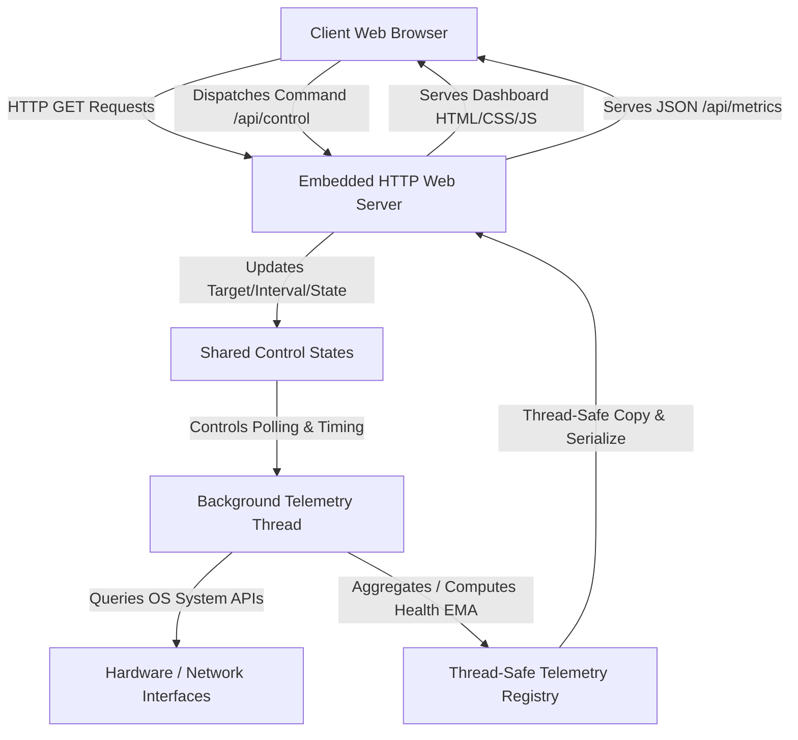
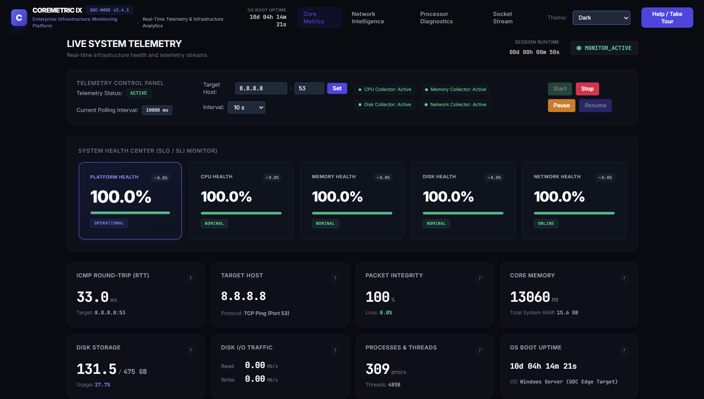
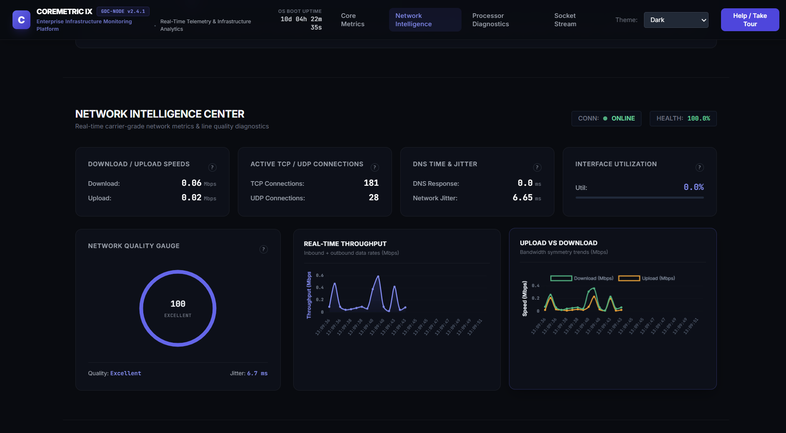
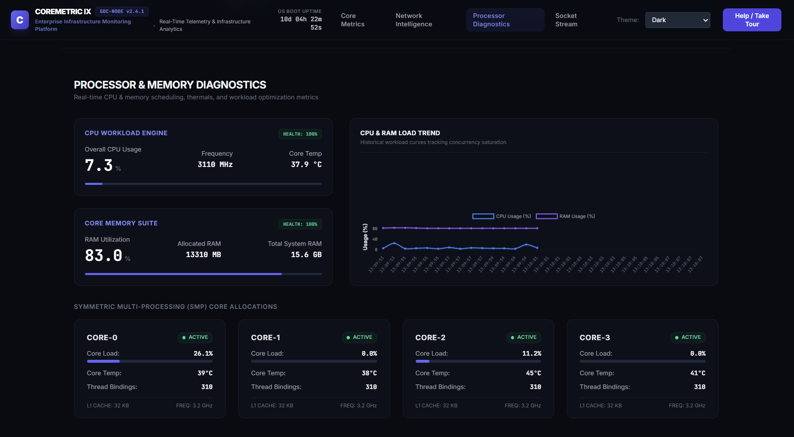
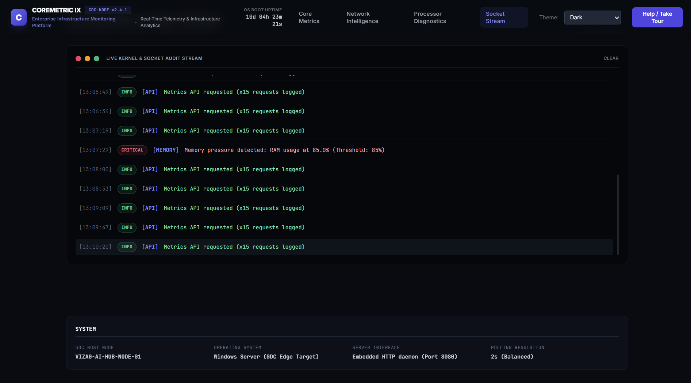

# CoreMetric-IX
<p align="center">


</p>

A high-performance, single-file C++ systems engineering tool that combines a multi-threaded embedded HTTP server, an asynchronous background hardware/network telemetry engine, and a premium real-time diagnostics dashboard.

---

## 1. Project Overview
**CoreMetric-IX** is an enterprise-grade infrastructure and network telemetry monitor. It is compiled as a single, dependency-free binary with an integrated web app. It is designed to run with minimal overhead, polling low-level OS APIs directly to collect performance diagnostics, network speed metrics, and socket events, rendering them instantly onto a highly responsive, modern dashboard.

---

## 2. Features
- **Real-Time Diagnostics**: Sliding-window performance audits for CPU, Memory, Disk space, and running Processes/Threads.
- **Network Intelligence Center**: Active measurements for download/upload traffic, connection counts, DNS resolve latency, packet loss, and jitter.
- **Low-Overhead Telemetry**: Background polling thread that queries system APIs (Windows API/Winsock, POSIX, Sysctl, `/proc`) every 2 seconds.
- **Dynamic Scoring Systems**: Control-systems style health calculation featuring Exponential Moving Average (EMA) filtering to smooth out transient packet losses and timeouts.
- **Socket Audit Stream**: Real-time severity-coded log reader monitoring client requests, target handshakes, and event thresholds.
- **Zero Configuration**: A single compiled binary serves the HTML, CSS, JavaScript, and JSON API payloads automatically.
- **Dual-Theme Adaptive UI**: Seamlessly transitions between a dark cyber-slate style and a clean light mode, adapting chart canvas properties dynamically.

---

## 3. Architecture
CoreMetric-IX leverages a modular, single-file C++ and Javascript hybrid architecture:



---

## 4. Telemetry Engine
The background telemetry engine runs continuously as a separate thread. It performs the following processes:
- **CPU Metrics**: Retrieves overall load using system-level delta tracking (`GetSystemTimes` on Windows, `/proc/stat` on Linux, and `host_statistics` on macOS).
- **Per-Core CPU Diagnostics**: Dynamically splits and queries load details for up to 4 individual cores, generating live load progress tracks.
- **Memory & Storage**: Tracks MBs of RAM used/total alongside GBs of disk space allocations.
- **Network Intelligence (Active Probe)**:
  - Establishes a lightweight TCP connection to target port `53` (defaulting to Google DNS `8.8.8.8`) to measure RTT latency without requiring root privileges.
  - Maintains a sliding window of the last 50 probes to compute packet loss percentages and stability indexes.
  - Computes network jitter dynamically.
  - Measures DNS resolution time for `google.com`.
  - Calculates active TCP and UDP connection sockets.
- **EMA Health Scoring**: Uses an Exponential Moving Average algorithm to calculate and filter component health scores (`cpu_health`, `ram_health`, `disk_health`, `network_health`), which are then aggregated into a weighted overall `platform_health_score`. This protects telemetry stats against transient spikes or one-off connection timeouts.

---

## 5. Embedded HTTP Server
The HTTP server is built natively on top of Winsock2 (Windows) and BSD Sockets (POSIX/UNIX):
- **Concurrency**: Binds to port `8080` and utilizes an interruptible `select()` listener loop. Each connection request is dispatched to a detached handler thread.
- **Routing Table**:
  - `GET /` or `/index.html`: Serves the embedded dashboard page (`Content-Type: text/html; charset=utf-8`).
  - `GET /api/metrics`: Serves the serialized JSON telemetry snapshot (`Content-Type: application/json; charset=utf-8`).
  - `GET /api/control`: Parses query parameters to modify telemetry active states (`action=start/stop/pause/resume`), target hosts/ports (`host=X&port=Y`), or polling frequency (`interval=Z`).
  - `GET /favicon.ico`: Returns `204 No Content` to maintain clean browser log lines.
- **Deadlock Safety**: Mutex locks (`metrics_mutex`, `logs_mutex`, `target_mutex`) are operated sequentially without nesting. Threads copy records locally before serialization, avoiding thread-contention delays.

---

## 6. Dashboard Pages
1. **Live Metrics (Top Fold)**: Main KPIs showing real-time ping latency, loss rates, memory allocation, and connection stability metrics.
2. **Telemetry Control Center**: Live toggles to start, pause, resume, or stop the collector. Supports customizing target hosts, target ports, and polling intervals dynamically.
3. **Network Intelligence Center (Middle Fold)**: Circular gauge visualizer showing network health scores, active traffic speeds, DNS query response time, jitter, and interface utilization.
4. **Processor Diagnostics**: A grid displaying live utilization stats and simulated temperature telemetry for Core-0 through Core-3.
5. **Kernel & Socket Audit Stream (Bottom Fold)**: Rolling severity-coded log console tracking API requests, telemetry transitions, spikes, and threshold resolutions.

---

## 7. Technology Stack
- **Backend Core**: Standard C++11 (Standard Template Library)
- **Networking APIs**: Winsock2 (`ws2_32.lib`), SetupAPI (`setupapi.lib`), POSIX BSD Sockets.
- **Frontend Utilities**: HTML5, Vanilla JavaScript (ES6+), CSS3 Variables.
- **UI Framework**: Tailwind CSS (CDN-loaded configuration inline).
- **Charts Engine**: Chart.js (CDN-loaded canvas renderers).

---

## 8. Build Instructions

### Windows (MinGW/GCC)
Open a command prompt or PowerShell and compile:
```bash
g++ -O3 main.cpp -o monitor.exe -lws2_32 -lsetupapi
```

### Linux (GCC/Clang)
Compile with POSIX threads enabled:
```bash
g++ -O3 main.cpp -o monitor -pthread
```

### macOS (Xcode Clang)
Compile directly:
```bash
g++ -O3 main.cpp -o monitor
```

---

## 9. Installation & Running Instructions
1. Compile the binary using the appropriate build instruction above.
2. Launch the application:
   - **Windows**: `.\monitor.exe`
   - **Unix/Linux/macOS**: `./monitor`
3. Open your web browser and navigate to: [http://localhost:8080/](http://localhost:8080/)
4. The dashboard onboarding tour will guide you through the layout highlights.
5. Control state logs and warnings will print out directly in your console window and in the dashboard audit terminal.

---

## 10. Screenshots
### Core Metrics Dashboard



### Network Intelligence



### Processor Diagnostics



### Socket Stream


Verification screenshots and recordings of the system telemetry interfaces running in both light and dark themes are located under the artifacts walkthrough:

- **Dashboard Dark Theme**: Fully loaded dashboard showing live network telemetry and processor diagnostics.
- **Dashboard Light Theme**: The clean, high-contrast alternative layout adapting to light settings.
- **Circle Gauge detail**: Network Quality radial visualizer indicating healthy connections.

---

## 11. Future Scope
- **Multi-Node Monitoring**: Adapt the telemetry engine to receive metrics from multiple remote agents concurrently.
- **Alert Integrations**: Add Webhooks, Discord, and Slack trigger notifications when critical thresholds are breached.
- **Archive Logs Database**: Embed a lightweight SQLite database wrapper to allow historical search and long-term archiving of audit logs.
